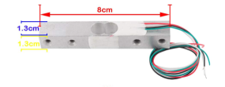
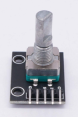
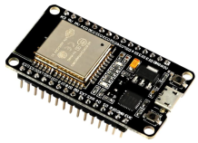
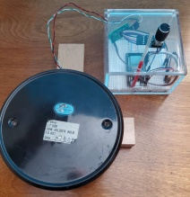
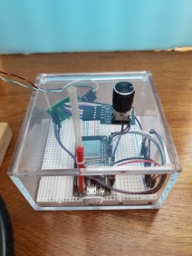
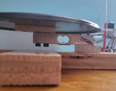
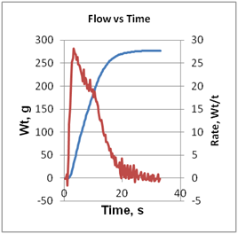

**Streaming of load cell weight measurement to Google Sheet using an
ESP32**

**INTRODUCTION**

This project was developed to stream time and weight data from an ESP32
connected to a load cell through an HX711 module, to a Google Sheet. The
process, uses an embedded Google App Script to import the data into the
Google Sheet.

The goal behind the project was to mirror the function of a
uroflowmeter, a simple device to measure urine flow rate and volume. To
appreciate, or maybe shudder at what it does, you are probably older
than 60, and probably male. Uroflowmeters are a tool found in urologists
office. The fancy name (and price) disguises nothing more than a load
cell with some sort of collection bucket, which connects by wire or
wirelessly to a computer or phone. The device tracks urine flow rate,
maximum flow, and how long it takes, usually also plotting the data. One
use of the device is to monitor urinary retention, which is a common
problem in men.

Notwithstanding the specialized use, the project may have wider appeal.
As of the writing of this document, I found almost no information on
streaming data arrays to Google Sheets with an ESP. There are a plethora
of tutorials, blogs, and forum questions discussing logging of
temperature, humidity, and barometric pressure data, or other small
single value variables from ESP 8266 or ESP32 MCUs, but such data is not
transferred as arrays of points.

Another aspect of this project that differentiates from others is the
need to balance the timing of data collection and data transmission.
Most tutorials ignore the fact that WiFi transmission of data can be
much slower than the frequency of data accumulation. The oversight is
understandable; weather information changes slowly. Here we are
concerned with the relative transfer rate issues.

Three points need to be made on the nature of this project:

1\. The device is not a medically certified uroflowmeter. Due diligence
and caution is required to interpret output. You build it and use the
codes, you suffer the consequences of a badly defined or wrongfully
interpreted end use.

2\. As a relative beginner in microcontroller use and coding, I have
enough knowledge to recognize places where code improvements could be
made. The current code has the advantage of working for me, albeit with
a few quirks.

3\. The equipment was designed for temporary use, so no extraordinary
effort was made to turn it into a permanent device.

There is more detail provided than in a lot of projects, especially the
logic of some hardware and coding choices. My hope is that the many
hours of thinking, confusion, and wrestling with two separate regimes of
code, helps speeds up someone else's efforts to expand and develop more
efficient solutions. I tried to not overly interpret some code or
hardware issues, at the risk of being wrong. Thankfully, examining and,
in some cases, copying, bits of code examples from others saved me. I
was also aided by previous experience in developing a project to monitor
my sump pump water level with an ESP32.

*What does this project do and not do?*

1\. Data is not sent in real time; it is collected and stored in memory,
then sent in a burst mode to a Google Sheet. This limits the number of
points that can be collected, based on the ESP32 memory available.
Weight and time data are collected at a rate of approximately 3 readings
per second with each reading being an average of three sensor reads. Up
to 500 weight and time data points with two decimal point resolution are
supported. More points may be possible at this accumulation rate; the
maximum limit was not fully investigated. Thus , around four minutes of
readings can be taken at the 3 readings per second. It is not likely
that data can be taken much faster unless foregoing the averaging
process, reducing the data rate, and/or resolution. I will explain more
about this later.

2\. There is no real time data display, unless using the Arduino IDE
serial monitor. The reason is the additional time overhead. Moreover,
the only advantage of a display would be in monitoring for problems, or
during calibration, which hopefully, are rarely needed. Instead,
operation status is indicated by LED changes on the ESP32 module. On my
module, and most other cheap modules, there were two LEDS. One LED
indicates power, and a second LED (blue in my case), can be user
controlled through pin 2. Steady or certain flashing sequences tell the
user the state of operation.

3\. A tare is taken when data streaming is started. Thus, anything on
the scale when a run is started becomes part of the tare.

4\. Although there is a default scale factor (explained later) and a
default tare value, there is a built-in calibration function that can be
used to recalibrate for the length of a single run.

5\. An issue that was not resolvable, was that a reset was required for
each run. Reset is automatic after data has been transferred. Data
is therefore lost after transfer to the Google Sheet, or a failure.

6\. A rotary encoder with push switch functionality controls the
operational modes.

7\. It is possible to avoid setting up a Google Sheet and App Script,
and just send the data to the Arduino IDE Serial Monitor, or other
console output.

**2. OPERATION**

Some of the discussion will not be understood without further reading
and examining some of the excellent tutorials on load cells with
Arduinos or ESP MCUs. There is a lot of information with the former, and
less with the latter.

*2.1 Initial setup*

The purpose of this section is to set the stage for more advanced
discussion, and to provide an immediate idea of the capabilities and
limits of the device and codes described here.

If you only intend to send data to the Arduino Serial Monitor or other
console output, in the sketch, find and change the variable
*output\_type* = PRINT\_TO\_SERIAL. You will not need the ID of a Google
Script, nor your router SSID and password.

There is always a cart-before-the-horse process in any uncalibrated
scale system. It is necessary to find the scale factor to convert the mV
load cell output that the HX711 interprets to a digital value, to a
weight value. Thus, a known standard weight is a necessity. In the
commercial and scientific world of accurate scales and balances, all
reputable certified standard weights can be traced back to the primary
international standard. There are different levels of accuracy
certification for standards. Clearly, the standard weight needed here is
well below stringent commercial requirements. A known weight "standard"
that is at least known to the expected lower limit of the weights the
scale is expected to accurately measure is necessary. Unless, you happen
to have certified weights handy, they are overkill for the load cells
and circuitry used here.

Every scale set up will have a different scale factor, which depends on
the manufacturer's load cell material characteristics, the design of the
load cell, the position of the piezo sensors, the arrangement of
spacers, and the sample holder connected to the load cell.

Scale resolution is not the same as the scale factor, but is related to
it. The former is how accurate the scale can potentially be; As with the
scale factor, it must be determined experimentally. Any known weight,
sufficiently heavy to cause a well-defined reading above the statistical
error limits of the system is sufficient to help define the resolution.

*2.2 Routine Operation*

For convenience and a quick understanding of how the project works, the
operation of the hardware and sketch will be presented first, and
explained later. Highly recommended is to first follow the operations
using the Arduino IDE serial monitor, or other console output.

*2.3 Data accumulation*

For streaming to a Google Sheet, you should have already gone through
the process of creating a Google Sheet and associated Script, and made
changes to the *scale\_streaming* sketch to update with it with your
SSID, router password, and App Script ID before these steps. However,
the sketch can just print the data to the Arduino IDE serial monitor.

1.  If not already done, load the sketch, *scale\_streaming.ino* into
    the ESP32.

2.  Plug the ESP32 into a power source, whether a USB port or a stable
    standalone power module.

3.  Press the reset button on the ESP32. On the typical cheap modules,
    this is the button to the left of the USB port. Only the red power
    LED should be lit at this point. (The description of red and blue
    LEDS follows my modules characteristics. The blue LED is user
    controllable.)

4.  Add any necessary sample holder, e.g., a bowl, to the load cell pan.
    Press the encoder button switch, without turning the encoder shaft.
    If the switch click registers properly, the indicator LED will show
    solid blue indicating data is being collected. If the LED does not
    light, press the button again.

5.  To stop data collection, and transfer data to the Google Sheet,
    press the encoder button again without turning the shaft. If the
    click registered, the blue led will flash for a few seconds, then
    return to a steady glow. This indicates that the ESP32 is attempting
    to get date and time from NTP servers, and send the data to the
    Google Sheet. If instead of a steady light, the LED flashes faster,
    it indicates that the ESP32 was not able to connect to the Google
    Sheet. Repeat the data collection. The current data is lost; there
    is no provision for retrying to send the data. If the problem
    persists, it is advisable to hook the scale to a computer and use
    the Arduino IDE Serial Monitor to help display potential issues.
    When the blue LED goes dark, the data has been transferred. Check
    the Google Sheet to verify transfer. Note that if a large amount of
    data is transferred, it may take some time for the App script
    associated with the Google Sheet to completely process the data.

6.  Three columns of data should appear on the Google Sheet: assuming
    the scaling weight was in grams; time in seconds, weight in grams
    (or whatever units were defined) and the rate of change between each
    data point, e.g., g/s. In addition, a timestamp of when the data was
    processed by the Google App Script, and the scale factor added.

*2.4 Calibration Procedure*

This calibration is not the primary calibration that is necessary, and
is described in detail later on. The calibration scale factor and tare
in the main sketch are not permanently saved in ESP32 memory. (The
reasons will be discussed later.) The scale factor and a starting tare
value are locked in as a variable (*scale\_factor*) in the code, and
must be manually obtained prior to routine weight measurements. THE
SCALE FACTOR FOUND IN THE SKETCH IS ONLY APPLICABLE TO MY PARTICULAR
SYSTEM. However, for any single run, a calibration function is included
in the sketch that allows an on-the-fly calibration. Using this still
requires some forethought, and preliminary modification of the sketch
before using this sequence:

1.  Obtain an object with a known weight. Keep in mind it is better to
    use a heavier rather than a light weight, to minimize errors.
    Although far from ideal, even water can be used, as long as the
    volume is accurately known to the desired resolution, and you intend
    to always use the same volume as standard; assume a weight of 0.997
    mL/gram for the conversion, or better, look up the density of water
    at the ambient temperature. If using water, use a large amount, at
    least a liter for the type of load cell discussed here, if within
    the balance limit. This will ensure that inaccuracies in measuring
    the volume are minimized. For short term use, evaporation is not an
    issue.

2.  Open *scale\_streaming* sketch in whatever IDE you use for code
    editing. Find the "*calibration\_wt*" variable near the beginning of
    the sketch, and change the value to the standard weight. Save and
    reload the sketch onto the ESP32.

3.  Start the ESP32, press the MCU reset button, if necessary.

4.  Turn the encoder shaft one click counter clockwise (CCW) without
    depressing the button switch. The blue LED should flash indicating
    the rotation registered, if not turn CCW again.

5.  Press the button switch once, without turning the shaft. If the
    press registers, the blue led will begin slowly flashing; this
    indicates it is getting set to take a tare reading. Typically, this
    is when all weight is removed from the scale. You have 10 seconds to
    complete the operation.

6.  When the blue LED begins rapidly blinking, add your standard weight
    to the balance. You have 10 seconds to complete the transfer.

7.  When the LED goes out, the sketch is ready to take data (if using
    the IDE serial monitor, the value is also printed out. Do not reset
    the ESP32, which would reset the scale factor to the value
    permanently defined in the sketch. You do not need to turn the shaft
    back to its original position. The position is automatically reset
    in the code.

8.  Take your weight measurements, according to the previous procedure.

**3. HARDWARE AND CONSTRUCTION**

*3.1 Parts needed/used:*

10 kg Digital Load Cell Weight sensor




HX711 module (Typical version with HX711 IC pin 15 having a trace to
GND.

KY-040 Rotary Encoder Module



ESP-32S Development Board, ESP WROOM 32




Plastic case to hold circuit and mount rotary encoder.

Two 3x3 solderless breadboards.

Wire

The load cell electronics worked fine; the mechanical aspects not so
much. On the set of two Chinese units I purchased from Amazon, the
mechanical drawing of the 10 kg load cell specified M4 and M5 drilled
and tapped holes. However, all the holes were M4-0.7.

*3.2 Mounting of the Load Cell and Circuitry*

The project was not meant to create a permanent device. Rather than
soldering modules onto a PCB board, or using headers, they were either
"free floating" or mounted on a solderless breadboard.

The load cell base was made from scrap 3/4" engineered flooring fastened
in the form of a cross. The pieces were cross slotted to maintain a
completely flat base, and fastened together with a countersunk wood
screw. Spacers are necessary to permit bending movement of the load
cell. The mount for holding the load cell to the wood base was a
rectangular aluminum rod 3/8" x 1/2" x 1 x 1/4", drilled to accommodate
the two screws holding the cell to the base. The wood base was drilled
and countersunk to accept two M4-0.70, 40 mm machine screws to attach
the base through the spacer into the load cell. (35 mm screws would have
been a better fit, but not what I had).

 

On the pan side of the cell, a 3/8" x 1/2" x 2" Delrin spacer was
drilled and tapped to accept two M4 x 20 mm machine screws. An
additional two 1/8" holes were drilled through the spacer and a 15 cm
metal flat plate. Pop rivets were used to attach the plate to the
spacer. I could have made another aluminum spacer, but the piece of
Delrin was just the right size, and what my eyes first set on when
looking for spacer material. There is no more profound logic, in the
choice of materials. However, I did shy away from soft spacer materials
such as wood that might reduce or cushion load cell deflection changes.
The pan plate was salvaged from the base of an old, long-gone lamp. The
plate was slightly indented at the pop rivet holes to ensure a flat top
surface, and the Delrin spacer was also slightly countersunk to
accommodate the indentations.

To fit the typical cheap ESP32 module to a solderless breadboard is a
bit of a hack. They will not fit conveniently on a regular breadboard.
Although the way to get around this goes back a number of years, this,
*<https://www.youtube.com/watch?v=CQlbE1x2i2g>\>*, video link shows very
nicely how to fit two half size bread boards together so that enough
pins are exposed for convenient connections.

The completed "system":



*Figure* *1. Top view of scale and electronics.*

The 4" x 4" x 2" acrylic, hinged lid box was purchased from Amazon to
protect the electronics from splashes, and provide a solid mount for the
rotary encoder. The side by side breadboard arrangement fit perfectly
into the box after filing off the small tabs on the side of one of the
breadboards. A 5/16" hole was drilled through the top of the box to
mount the rotary encoder. A very small notch just adjacent to the larger
hole was added to accommodate the tiny detent on the encoder, which
prevented the encoder base from turning when the shaft was turned. A
second 1/8" hole was drilled in the cover just over the reset button on
the ESP32 module. A small piece of flexible pushrod (typically used to
connect servos to control surfaces in radio controlled models) was
inserted, to allow resetting of the ESP32 as needed. The pushrod thing
worked, for a temporary set up, but a elaborate, rigid holder for the
pushrod affixed to the box face would have been welcome. The bottom side
of the box was drilled out and shaped with a Dremel tool, for the USB
port connection to the ESP32. The HX711 module was left "free floating"
in the container.

Here is a close up of the container:



*Figure* *2. Close up of electronics. Encoder is attached to box lid,
while HX711 in back of box is "free floating". The red tube is the
pushrod sleeve over the reset switch on the ESP32. The Dupont connectors
on the wires from the load cell and from the Hx711 to the breadboard
were added; they were not shipped with the parts.*




*Figure* *3. Side view of scale showing 10 Kg load cell. The pan is really parallel with the table top; the image is distorted.*

This side view of the scale shows the detail in the load cell
arrangement. The aluminum spacer, attached to the hardwood flooring
cross is at the bottom, and the Delrin spacer at the top of the load
cell. There are two washers between the load cell and Delrin spacer,
because the screws were just a bit too long.

*3.3 Hookup*

Connection of the modules to the ESP32 was straightforward. The below
table shows the pin connections to the HX711 from the load cell as
indicated by the seller, and my HX711 and encoder pins to the ESP32 pin
connections.

| **HX711 cell header** | **Wire**  |
| --------------------- | --------- |
| E+                    | RED       |
| E-                    | BLACK     |
| A+                    | WHITE     |
| A-                    | GREEN     |
| HX711 Output          |           |
| **HX711**             | **ESP32** |
| GND                   | GND       |
| DT                    | D19       |
| CLK                   | D21       |
| VCC                   | 3V3       |
| **ROTARY ENCODER **   | **ESP32** |
| CLK                   | 4         |
| DT                    | 23        |
| SW                    | 22        |
| \+                    | 3V3       |
| GND                   | GND       |

 Although the HX711 module supported up to 5 V, the 3.3 V output pin
from the ESP32 was used as the power source for the HX711 and rotary
encoder. I believe that if I had used a quality, stable 5 V power source
to the HX711, a slightly better resolution would have been achieved,
because the sensitivity is rated as 1 mV/V. So over the same weight
range, the mV output might be higher. For my application, the resolution
performance turned out to be adequate for my needs.

There are several changes that need to be made to the sketch before
loading it into the ESP32, unless you only intend to use the Serial
Monitor for output:

1)  Your WiFi router SSID and password needs to be added.

2)  The ID of the Google App Script that will convert and add the data
    to the Google Sheet needs to be added. Thus, you will want to
    particularly read the section regarding the Google Script and Sheet
    in the document, before trying anything.

  

**4. INTIAL CHECK OUT AND CALIBRATION PROCESS**

The first decision to be made is how to define and maintain the scale
calibration. The piezo sensors attached to the load cell are connected
to the HX711 in a Wheatstone bridge arrangement. The sensors change
their resistance, based on miniscule deflections of the aluminum beam.
The resistance difference change is converted to a digital output by the
HX711 module. By using a weight standard, whatever weight unit the user
chooses is related to the ADC output of the HX711 through a scale
factor. In this document, all the scale factor units are in grams/ADC
unit. (Well...not really; for the HX711 library I used, it is the
reciprocal...see below).

One important question was whether it is necessary to determine a
calibration factor each time the scale is used. Surprisingly, the many
examples available on the internet generally explicitly ignore
addressing this question. A lot of effort can be eliminated, if the
scale factor and tare are stable over a long term. I decided to get at
least a first order answer to the question. With some adaptation, the
approach should be considered a general method for determining
calibration factors.  

Two different sets of weights were used. I happen to already have a set
of commercial standard brass weights in the range 1 to 100 grams. A
second series of higher weights was prepared using a double beam two pan
balance. The weights greater than 100 g were a series of scrap brass
cutoff pieces from lathe work. I could weigh these larger weights to an
accuracy of ~0.1 gram. Because some of the weights exceeded the capacity
of the direct beam weight range, weights with values above 200 g were
managed by first measuring the weight of the lightest brass piece, and
using that plus the previously measured heavier weights, plus the direct
reading beam weights to derive the heavier weights. The weight values
were crosschecked when possible. The derived values were all within 0.1
gram.  

Based on calibration sketch examples from others,
*scale\_calibration.ino*, was devised, and is included in the
repository; it is primitive, but it got the job done using the Arduino
IDE. Without much discussion on detail of the code, this is how it is
was initially used with the Arduino IDE: Once the sketch is loaded into
the ESP32, open up the serial monitor, and make sure "*No Line End*" is
set at the bottom. Start data reading by placing the cursor in the send
line at the top of the serial monitor, pressing any key, and clicking
the "Send" button. A set of readings are taken that constitute an
initial tare reading. The serial monitor will then indicate the
calibration weight be added, and the value input into the monitor send
line. Next, a notice to remove the weight will show up and an additional
tare sequence is run. 100 values of an averaged 10 reads was output for
the weight readings, and an averaged value of the tare readings. The
stream of data was manually copied (Crtl-C) from the Serial Monitor to
an Excel spreadsheet for easy manipulation.

 

Using the *scale\_calibration.ino* sketch in the repository, data was
read and combined from separate days. The intent of the data analysis
was twofold: First, examine the variations in the scale factor and the
tare or empty scale pan to get an idea of the magnitude of variation in
values to expect, and second, to decide if it was possible to use a
locked set of values for the scale factor and the offset value. The
weights used ranged from 166 g to 1276 g.

What was found is that different days showed different offsets, but the
offset for any particular day was stable for a period of up to a couple
hours of analysis time. The overall range of the offsets was from +12371
to +13459 ADC units with a standard deviation of 347. That is a large
range. Variations could be due to temperature differences; the local
temperature was not explicitly monitored, and these were open system
tests, where the electronics were not enclosed in any way. However,
other than lack of temperature and humidity control, local conditions
were not different, across all the days.

 

The scale factors were more stable, with an average of -214.57 ADC/g and
standard deviation of 0.10.

In an attempt to better define the scale factor, and at least a
representative offset, a study was done with a range of weights, using a
forced, e.g., standardized, scale factor of -214.48 and an offset of
12852. A separate sketch included here, *scale\_test.ino*, was used.
These initial values were from a set of 13 calibration runs on a single
day over the same weight range indicated previously. Two sets of weight
values in tandem were read for each standard weight: 20 readings of
averaged 3 readings each, and 20 weight readings that averaged 100
readings each.

The table below shows the result of an analysis of the 20 x 100
readings. To especially refine the scale factor, the original ADC
readings from the set of calibrated standards was subjected to
optimization using Excel's Solver function, minimizing the sum of
squares of the ADC values. The function to minimize was the linear
equation. (*Calibrated wt)\* (scale\_factor) + offset* starting with the
original locked values and with constraints: (
-200\>scale\_factor\>-230); (offset \>
12000).

 

**Optimization of scale factor**
|**calibration wt**|**original wt**| **Recalc wt.** |
|-----------------:| -------------:|---------------:|
| 0                | 1.06          |  0.34          |
| 1                | 1.78          |  1.06          |
| 2                | 2.56          |  1.84          |
| 5                | 5.44          |  4.72          |
| 10               | 10.62         |  9.91          |
| 20               | 20.77         | 20.05          |
| 50               | 50.83         | 50.12          |
| 100              | 100.78        | 100.06         |
| 298.1            | 298.64        | 297.94         |
| 597.6            | 598.35        | 597.66         | 

*original weights are average of 20 x 100 averaged reads*
<br/>
*original scale and offset, respectively; -214.48, 12853* 
<br/>
*calibration weights are actual weights.*
<br/>
*Recalculated weights with Solver optimized scale: -214.469; offset: 12962*

 
The correlation for the optimized values with the standard weight values
were acceptable, and completely linear in the range investigated.
Attempts to start with different initial scale and offset value still
converged to the scale factor and offset indicated in the table.

The optimized values in the last column ended up with a scale factor
very close to the scale factor averaged over different days runs, but
not the averaged offsets from different days.

 

The data also suggest the magnitude of the errors that can be expected
for various weights. As anticipated, low weights show much higher
relative variation. However, considering the load cell had a maximum
capacity of 10 kg, that a 1 gram load could even be measured is
gratifying. According to the data, a 1 g weight is equivalent to 214 ADC
units for this particular load cell and conditions.

 

The similarity of all scale factors, but the larger variations in offset
values, suggested a reasonable path forward for routine measurements
could be based on the idea of using a specific scale factor (-214.469),
but that the each block of weight measurements required obtaining a
specific offset for that measurement period. Because the offsets
appeared stable for at least a couple of hours, there was no necessity
to do a tare reading for each measurement. This made using the scale a
lot more efficient, without excessive error.

 

**5. PROGRAMMING FOR STREAMING**

The anticipated rate of weight change expected as a "uroflowmeter" was 0
to 20 mL/s (20 g/s). As with any measurements, more is better, with
limiting considerations being impacts on the error levels, memory
overruns, and transfer rate issues. The final code is always some sort
of compromise. The final solution was arrived at after some detailed
consideration of the limits.

The HX711 chip has a data output rate of 10 Hz or 80 Hz. Modules are
initially set to 10 Hz, with the possibility of changing to 80 Hz. In
almost all cheap modules, some method of breaking the HX711 chip's pin
15 from ground is necessary. Although not universally true of all
modules, my HX711 modules have a clear trace from pin 15 to the GND pin,
which has to be cut. This is a permanent change. The question arises as
to whether increasing the frequency is really a simple 8 fold increase
in rate, or are there any hidden issues? The answer is to be aware of
the output errors of the chip at different data rates.

According to the HX 711 chip specifications, there is a corresponding
increase in noise changing from 10 Hz to 80 Hz. From
the [<span class="underline">HX711
datasheet </span>](https://cdn.sparkfun.com/datasheets/Sensors/ForceFlex/hx711_english.pdf),
with a gain = 128 and a rate of 80Hz, the input noise is 90nV(rms); at
10 Hz, the noise is 50 nV(rms). Thus, an 8x increase in data rate
produces only 2x noise. Whether the module with additional circuitry
holds that relationship is unclear. In practical terms, there is a clear
tradeoff between precision and increase in rate. However, what does that
increase in noise really mean for the accuracy of weight measurements?

We start with the position we want to have the same accuracy in our
measurements at either frequency. Our averaged values should fall within
the same confidence interval at either rate, that is they have the same
possible variation from the "true" value. This is a statistical
calculation. We need to figure out the confidence limits for each case.
The calculation for this is:

 

*x = +/- Z(s/sqrt(n),*

 

x is the average value; Z is the Z score, which is defined as 1.96 for a
95% confidence interval (and a Gaussian distribution of values); s is
the standard deviation, and n is sample size. Assume we want to take at
a minimum 3 readings per second, and average 3 reads per reading, For
comparison, we will assume the nV variation as the standard deviation.
We find that to have both data rates produce values in the same 95%
error interval requires 9.7 (10) reads at 80 Hz to 3 reads at 10 Hz.
(The calculation is derived from equating the two confidence limits,
e.g., n<sub>80</sub> =
n<sub>10</sub>(s<sub>80</sub>/s<sub>10</sub>)<sup>2</sup>.

If we want to be sure the values in both sampling rates will fall within
95% of the true value, we need to average 80Hz/10 reads = 8 values/s
versus 3 values/s, which corresponds to a 2.7x increase in effective
rate, not 8x. The resolution of the data will still be better at 80 Hz,
just not in one to one relationship with the 10 Hz data rate. Of course,
a different scenario is to use 80 Hz and just do more averages to match
the 10 Hz rate. At a rate of 3 values/s, instead of being able to
average 3 values, the average would be roughly 22-23 values per reading,
which decreases the confidence limits ( higher accuracy - value likely
closer to true value).

We also will have some processor overhead to store the values. My first
reaction was that modifying the HX711 to an 80 Hz rate would still need
to be dictated by whether test data confirmed a real need for the
increased resolution. Start small and complicate life on a "need to"
basis.

Another important limit that must be considered against increasing the
data rate is data storage. All that incoming data must be stored
somewhere. Could we just open up the wifi connection to the spreadsheet,
and dump the data a the same time as it accumulates? Unsure, but
definitely not with my level of expertise.

Moving data from the ESP32 over the WIFi connection while simultaneously
taking data depends on the stability and speed of a wifi connection to
the internet, and how loaded down the Google servers are at the moment.
Additionally, the calculation of the difference between points was found
to add a time penalty to the data transfer to the Google Sheet. From my
own experience, sometimes, data was transmitted nearly instantly, but
there were cases where many seconds elapsed before the data appeared in
the spreadsheet; this is despite having the ESP32 near the WiFi router,
a high throughput internet connection, and generally, a stable internet
transfer rate. The best approach seemed to be to store the data in
memory, and send it in a burst to the Google App Script, which in turn
populates the Google Sheet.

So the problem is pushed to worrying about whether there is sufficient
memory to store the data. The smaller the change we need to accurately
observe, the faster we need to take data, and the more memory we need;
this is always an important balancing act, especially with the limited
memory of an ESP32, or even worse, an Arduino Uno.

There are several nuances to deciphering the problem of memory storage.
Foremost, is how fast do we really need to collect data? This is a
question of weight resolution. What is the best resolution we can
expect? It does us no good if the resolution is so low that important
details of a flow process are lost. As an extreme case, consider a
single interval reading at the start and end of the flow stream. We do
get the average flow rate, and total flow, but the details of how we got
there are a black box. In many cases, how we got there has importance.
Therefore, we need to know something about the resolution of the scale.

The previous discussion on calibration shows that we are able to get
acceptable agreement with standard weights, but that the precision of
the results was not really discussed. In the experiments on weight
calibration, initially two sets of data were taken. Both sets consisted
of 20 readings, but one set averaged 3 weight reads per output value,
and the other averaged 100 weight reads per output value. The latter
represents a much better idea of the achievable standard deviation. The
average standard deviation over the range of 1 to 598 g was 0.12 g for
the lower average set, versus 0.07 g for the larger averaged set. A
later set of experiments using a single weight reference and the
circuitry enclosed in the box, included 20 single reads. In that case,
the standard deviation for 20x100 readings was 0.028 g, averaging 3
reads/reading was 0.157 g, and for 20x1 reads/reading was 0.147 g. As
expected more readings reduced the variance, but averaging 3 reads per
output result produced no clear advantage over single reads. For the use
here, even a 2σ (99 % envelope) range of 0.45 g was acceptable.

Despite the similarity of the data between no averaging and averaging 3
reads per value, it was decided to use 3 HX711 reads per output weight
reading, because the rate has to also be balanced against the ability to
store the data. At a data acquisition rate of 10 Hz that translates to
approximately 3 readings/second.

The minimum resolution discussion provides a floor for evaluating the
lower weight limit achievable. A read frequency of 3 Hz translates to a
resolution of 6.7 g/point at the expected maximum flow rate, but I
thought most data would be in the range of 4 g/point, with final volumes
typically between 100 and 800 g. The numbers turned out to be quite
different ( using the Histogram function in Excel): 70 % of the values
were below 6.7 g/point, with maxima of ~8 g/point (24 g/s), even though
the average was in the range of 4 g/point). The good news is that the
flow rates are well above the resolution of ~0.5 g.

At the maximum flow rate, in the time it takes to get, store, and maybe
output a weight and time value pair, as much as 8 g more liquid could
have been added. We are unable to say anything about the 8 g variation
within that time interval, except that the result represents an average
weight over the interval. We have not lost the data, it ends up in the
next measurement. However, this also means there is a small lag factor
between points, where the next measurement depends to some extent on the
previous interval. If the collection time carries critical information
with rapid changes, such as weight spikes, then the low data rate is
unacceptable. For instance, counting rapidly dropping items on a pan,
where the drop rate is variable and important would not be viable. In
the current use, the small distortion is superfluous, because the stream
is typically continuous over the 300 ms frequency interval.

The monster that limits data accumulation at the limit of detection is
data storage. Without averaging, at 10 Hz the maximum resolution
corresponds to 0.8 g/point variation at maximum flow rate. So why not
just collect data at 10 Hz, which improves the signal to noise, and
allows more confidence in interpreting flow rates? The reason is the
limited storage capability of even the ESP32.

Regarding the memory storage issue, I found myself outside my ability to
thoroughly understand all the nuances of ESP32 memory, see for example,
ESP32 Memory Analysis — Case Study,
*\<<https://blog.espressif.com/esp32-memory-analysis-case-study-eacc75fe5431>\>*
I mostly resorted to wing\_and\_prayer methods.

The return from the HX711 library is a floating point number. A floating
point number is 32 bits and requires 4 bytes of storage, but to send the
information via http requires it to be converted to String or character
data. We must generate a continuous stream of characters representing
the scale fraction, time data, and weight data. Naively, each character
can be defined as one byte, so it would be prudent to limit the number
of characters. One way to do that is to limit the number of decimal
places for each data point. The resolution of the balance based on the
standard deviation was roughly 0.1 g. Just to be safe, two decimal
points were considered for the time and weights. At a maximum size, a
data point requires up to 7 bytes for a time value, and at 10 kg limit,
8 bytes for a weight, plus two bytes for comma separating data (ignoring
brackets and braces). A further decrease in memory use is to multiply
each value by 100 to eliminate the decimal point, and let the Google App
Script handle the conversion back to a floating point value. This was
not done, because in the end there was sufficient memory to handle the
amount of data generated.

There is underlying inefficiency in data storage and manipulation of the
final string array that is sent out to the Google App Script. After some
research, I reckoned more efficient string manipulation, which would
allow large string arrays to be handled more efficiently, would take a
lot more time to develop with my limited background. I will just frame
out the problem.

There is a String class for character storage with a set of defined
methods for handling strings, and a standard C string storage
definition, with its own set of methods. The two are related, but the
String class can lead to memory limit problems due to where and how the
strings are stored in memory. The advantage of using the String class is
that the associated methods for string handling, for example, catenation
of strings or characters, are especially convenient. This makes it very
convenient for dynamically changing string data, where the final size of
the string array is unknown. C strings are stored in a different area of
the ESP32 memory, and do not have the same issues with respect to memory
loss during use. The drawbacks are that character array size must be
specified before use, and manipulation is more complicated.

To get an idea of the memory impact using the String class, a string of
500 data points was generated, which produced a final String size of
6,266 characters. Using the built in memory functions of the expressif
ESP32 operating system, the difference in free heap size before and
after data accumulation was 49,616 bytes. This was out of an initial
247,016 available. In the end, I took the path of least resistance, and
used the String class. (It is possible that the reason that I could not
do more than one run without doing a reset was memory overruns of the
heap.)

*5.1 ESP32 Sketch*

I have already discussed how the sketch is used, but more discussion is
needed. The sketch has many comments, which should help with details, so
I will not break out a lot of code sections for detailed discussion.

A specific HX711 library from [Rob
Tillaart](https://github.com/RobTillaart)
*\<[<span class="underline">https://github.com/RobTillaart/HX711</span>](https://github.com/RobTillaart/HX711)\>*
, was used, which can be found in the Arduino IDE libraries. I was
confused on just how this library works, despite the examples.
Particularly, the scale factor was a number in the hundreds, when I
expected that the grams/ADC unit on a 24 bit ADC, should be a very small
fraction. I made a cursory foray into the guts of the library, to
understand its functioning, which might be helpful.

The library functions *get\_scale()*, *set\_scale()* and *store
\_scale()* use the reciprocal, *1/scale*, where scale is the input
value, i.e., the scale factor we see printed. In the specific case here,
we enter and print (ADC units)/g, but the internals use g/(ADC unit).
This is a bit confusing, if trying to use raw reads to validate errors
and limits.

 

  - The *tare()* function does one thing…assigns the variable, *\_offset
    = read\_average()*. Therefore *tare()* must be called at beginning
    of any sketch somewhere, or *\_offset* must be set using
    *set\_offset()*.

  - *get\_tare() { return -\_offset \* \_scale; };* is not used
    internally, it only allows a user to get the current tare value.

  - *tare\_set() { return \_offset \!= 0; };* assumes *tare()* has been
    run.

  - The calibration function does this:
    *calibrate\_scale(uint16\_tweight, uint8\_ttimes){ \_scale = (1.0\*
    weight) / (read\_average(times) - \_offset);*}

  - The r*ead\_average(times)* function just does primitive ADC
    *reads()*. Since *calibrate\_scale* needs *\_offset* that is why the
    tare is run before calibration. Now everything is known. *\_scale*
    would have units of g/ADC units.

  - To get a weight conversion, calls are made to the *get\_units()*
    function, which calls *get\_value()*, which returns *raw -
    \_offset*. So *get\_units()* returns the weight, which is really
    *(avg(raw) - \_offset)\*\_scale*, where *\_scale* has already been
    normalized to the difference between offset and the raw average
    readings.

Reading the above quickly is definitely confusing, but slowly following
it helped me understand how the library functions.

*5.2 Rotary Encoder*

The scale system was designed to run anywhere a power source was
available, and within router range, but without connection to a read
out, such as the Serial Monitor or LCD display. Therefore, some means of
controlling and indicating state changes was needed. A set of simple
push buttons could have been used. Instead, a single rotary encoder,
which could be easily mounted to the plastic case, seemed a good choice.
If I decided to add features, the encoder provided the flexibility.
After a little consideration, the best way to use the encoder was to use
button presses to start or stop operations, and the rotary functions to
indicate the type of operation to perform. To indicate whether a state
change had been correctly received or an operation ongoing or finished,
the ESP32 onboard LED, controlled by pin 2 was used with various blink
rates.

Unfortunately, bounce/debounce issues with the rotary encoder switch and
shaft rotation became evident. A common solution to the problem is to
place an RC filter circuit on both the button and shaft output. I was
hoping to avoid adding the extra components. I was using existing
encoder libraries, rather than writing my own code. Ultimately, I found
the bounce problem was acute using the
*a[i-esp32-rotary-encoder](https://github.com/igorantolic/ai-esp32-rotary-encoder)*
library. Switching to the
[*ESPRotary*](https://github.com/LennartHennigs/ESPRotary) library made
a huge difference. No additional circuit components were needed. There
still can be an occasional missed rotation or button press, but the
encoder operation is well-controlled using "blink without delay"
monitoring.

The sketch code itself should be sufficient to show how the encoder is
accessed. The function *rotary\_onButtonClick()* handles operation. The
default processing state is 0 (idle). Each operation request is returned
to this state. An initial button press changes the state to 1, which
begins data accumulation. Accumulation is stopped by again pressing the
button, and once the data has been sent, the process state returns to 0.
The only other processing state available is -1, which starts the
calibration function after a CCW rotation of the encoder shaft, followed
by a button press. The process is reset internally after calibration is
complete.

For testing or for internal use, without transmitting data via WiFi, the
variable *output\_type* can be set to PRINT\_TO\_SERIAL. SEND\_TO\_GS,
is used to transmit the collected data. (Although a timestamp is
obtained from the ntp cloud if using WiFi, it is not used, but is
printed to the Serial Monitor.)

Some time and memory can be saved by eliminating allowing the data to be
printed to the Serial Monitor. The print statements are left in, because
they might be useful when starting to use the sketch, and I found that
they were not particularly an issue for the data rate, and number of
points I was collecting.

*5.2 Data Output*

Once data collection is started, each time and weight value is
immediately converted to a string and added to separate string arrays.
When the run is finished, the string arrays are combined with the scale
factor and sent out to the App script. A typical final output string
will have this
structure,

*"scalefactor=\[-214.47\]\&times=\[0.31,0.61,0.92...etc\]\&wts=\[0.24,1.05,3.24...etc\]"*

where the first time entry corresponds to the first weight entry, etc.
One naive concern was how long a string could be sent via http. From
what I was able to find, the length may not have a limit. Of course,
this string must be attached to a url to send to the Script. The url has
the form:

*"https://script.google.com/macros/s/Aafghjklhjkl\_etc/exec?" *

to which the string is added. The jumble of characters in the url, is
the App Script ID obtained from Google when a Script is deployed. I will
not go into detail on the WiFi sending process. The basic data transfer
process was derived from the tutorial: *<span class="underline">Sending
ESP8266 sensor data to GoogleSheet</span>* From
*\<<https://arduinodiy.wordpress.com/2019/11/18/sending-esp8266-sensordata-to-googlesheet/>\>*
, plus my former experience with my sump pump project
*[GaryDyr](https://github.com/GaryDyr)/[Sump-Pump-Info\_Project](https://github.com/GaryDyr/Sump-Pump-Info_Project)
From \<<https://github.com/GaryDyr/Sump-Pump-Info_Project>\>*, which has
more detail.

 

**6. SETTING UP THE GOOGLE SHEET AND GOOGLE APP SCRIPT**

One aspect of the approach to recording the data was to avoid the
additional security issue of a third party to receive data from the
ESP32 and send it directly to the Google Sheet. Third party intervention
can have the advantage of simplifying some aspects of the transfer
process, but once the learning phase is over, using some Google Apps
directly becomes straightforward.

*6.1 Initiating the sheet and script*

A Google Sheet is used to store the data output from the ESP32. In
addition, a Google App Script associated with the Sheet is required to
accept the data delivered using the http protocol, and convert it to the
desired format to display on the Google Sheet. The Script language is a
variation of JavaScript.

From a Google Account, we need to make sure we have a Google Drive to
which we will add a Google Sheet. If you have a Google Account, you
already have a Google Drive. Click [My Drive - Google
Drive](https://drive.google.com/drive/my-drive),
<https://drive.google.com/>, to access it. On the left of the window
that opens up, click on the "+ New" icon and choose "Google Sheets".

I highly recommend you watch this tutorial on getting started with
writing Google Scripts: *Google Sheets Web App Example - Google Apps
Script Web App Tutorial - Part 1. From
\<<https://www.youtube.com/watch?v=RRQvySxaCW0&list=RDCMUC8p19gUXJYTsUPEpusHgteQ&index=1>\>
*

 

The following github reference will show the current process for
authorizing a Google Script; it has the latest information on working
with Google Scripts: *Taking advantage of Web Apps with Google Apps
Script From
\<<https://github.com/tanaikech/taking-advantage-of-Web-Apps-with-google-apps-script>\>*

 

Although Google changes or drops standards and applications
continuously, here is what worked to set up the Script as of the date of
this document. Starting from the new Google Sheet.

1)  Give the sheet a Title, for example,: *"Scale\_ESP32"*, but the
    title is not critical to the Script code.

2)  Copy the long string of characters representing the Sheet ID from
    the url of your Google Sheet and save it somewhere. You will need it
    in Step 7.

3)  From the menu, click *Extensions|Apps Script.*

4)  Give the App a Name, for example: "*Scale\_ESP32".*

5)  Remove the *"MyFunction"* starting code from *code.gs*. Copy all the
    code lines from the *scale\_streaming.js* file from the current
    github repository. Paste it to *code.gs*.

6)  Set the timezone in the *code.gs* file, in my case CST.

7)  Near or at line 25 in the script, replace the fake ID with the
    specific Goggle Sheet ID saved in (2).

8)  Once the changes have been made, click "Deploy". The "Deploy" icon
    opens a dropdown list: *"New deployment" (new version), "Manage
    deployments", or "Test Deployment"*. First time through, choose
    "new", a new version is created. "*New deployment*" really should be
    used when a really different version, with major changes, is
    created.

9)  A two panel window will open. Permissions for a web app differ
    depending how you choose to execute the app. Using a personal Google
    Account, the following permissions were used:

10) Click the gear icon next to Select Type, and select *Web App* and
    modify the following:
    
    1.  Enter a Description (optional): such as "*Stream weight data
        from ESP32 load cell.*"
    
    2.  Execute as: *Me.*
    
    3.  Who has access: *Anyone* (note: do not select *Anyone with a
        Google Account* - you must scroll down to the bottom to
        find *Anyone*. Despite the security issue, if you don't do
        this, you will have to somehow figure out how to automatically
        provide authorization in the sketch).

11) Click *Deploy. A*nother window will open with the credentials, with
    copy buttons for each. Copy the credentials to a secure place, you
    will need them for the ESP32 sketch and browser.

There are a couple of other choices available from the *Deploy*
dropdown: *Deploy|Test Deployment*, does not generate a new version as a
permanent setup. A temporary url is generated for immediate testing,
without creating a new version. *Manage Deployments* allows you to see
and archive old unused versions, but it offers a big advantage when you
need to tweak or fix script code. Choosing a Script version and clicking
the pencil (edit) icon, pops up information on the highlighted Script.
The first box is a dropdown list. The first choice is "*New Version*".
This choice reuses the old Script ID, and does not trigger the
re-authorization process; it saves having to constantly change the
GAS\_ID value in the ESP32 sketch.

*6.1 Script Editing*

The *Save* icon in the console saves the current script, but the changes
will not take effect until a new version is deployed. Any issues with
the code will appear in a terminal window below, upon trying to save the
Script.

 

While correcting the ubiquitous missing brackets and semicolons, and
finally the code logic, I found several operations made a big difference
in getting through the debugging process:

Adding lines like*: Logger. log(different\_stuff, + variable);* at
strategic points helped a lot initially.

 

Even more helpful was the addition of a function, found on the internet
called *fakeGet()*. This function generates a JSON object that is
normally output by some underlying Goggle server code that extracts and
converts the sent parameter data to a JSON object. By invoking it as the
debug function to call doGet(), I was quickly able to get through most
errors.

 

A third, necessary function, but also helpful debugging tool, was the
*returnContent(result)* discussed below. This function is called as the
result output of the *doGet(e)* function.

 

After deploying a version, copy the Google script url and paste it into
the browser. After "/exec" if deployed as New Deployment Web App, or
after "/dev", if deployed as "Test Deployment",
add

*?scalefactor=\[214.1\]\&times=\[0.00,10.00,20.00,30.00,40.00,\]\&wts=\[1.00,12.02,13.00,6.00,20.00\]*

 to the url.

*6.2 Script Code Operations*

 The critical function in the script is the *doGet()* function. It does
the work of receiving the data, parsing it and placing on the Google
Sheet.  When a script is defined as a Web App, it must contain either a
*doGet(e)* or *doPost(e)* function and has to return an [HTML
service](https://developers.google.com/apps-script/guides/html) [HtmlOutput](https://developers.google.com/apps-script/reference/html/html-output) object
or a [Content
service](https://developers.google.com/apps-script/guides/content) [TextOutput](https://developers.google.com/apps-script/reference/content/text-output) object.
There is a *returnContent(result)* function that sends the results of a
request back to the sender. The variable, *resultType* in the script,
controls the action of this function. If set to *"html",* it will open a
web sheet in the browser and display a status notice; this was useful
for indicating if the script was working. Normally, for communication
with the ESP32, this would be set to *"text".* A GET request from the
ESP32 seems counterintuitive, but it has a lot of advantages compared to
a POST request, and in this case we are not asking to change data.

A major difference from my previous experience with transfers to Google
Sheets, is sending arrays of time data and wt data, not simple single
valued variables. A request to the script, in this case a GET request
from the ESP32 sketch, is automatically paired with the *doGet(e)*
function, where "*e*" is a JSON object converted from the url call.
There are several objects inside the JSON
container:

 

*parameter* - An object of key/value pairs that correspond to the request parameters. Only the first value 

 is returned for parameters that have multiple values.

 *contextPath* - Not used here. Always empty string.

 *contentLength* - Always returns -1 for doGet.

  *queryString*
- The value of the query string portion of the URL. not used.

 *parameters*
- An object similar to e.parameter, but with an array of values for each key.

 

Despite how straightforward it seemed, how to get the individual values
from *e.parameters* was not clear. I could find no simple, reliable
examples that showed how to convert the JSON object values to an
iterable array from which to populate the sheet. After much thrashing
around, I finally found a single blog, discussing something other than
array data that used the standard function, *JSON.parse("key")* where
key is the name of the key to access. In the current case, the keys are:
"scalefactor" "times", or "wts" discussed in the previous section.

 

*fakeGet()* only gets a user so far in debugging with Logger statements.
The second stage of development was to work from a browser page and
deploy as a "test deployment". Here is an example of the url that was
pasted into the browser:

[https://script.google.com/macros/s/Abcddgederererer
dfewfrw/dev?scalefactor=\[-214.47\]\&times=\[0.31,0.61,0.92\]\&wts=\[-0.24,-0.05,-0.24](https://script.google.com/macros/s/Aoiuytrewmnbvcxzlkjhgfds/dev?scalefactor=%5b-214.47%5d&times=%5b0.31,0.61,0.92%5d&wts=%5b-0.24,-0.05,-0.24)\]

(Of course, the ID string is not the true ID string of the Script.)

This url was pasted into the browser url line and run repeatedly. To get
any idea of what was going on required dumping bits and pieces of data
scrapping attempts to specific cells, until I ultimately got rationale
answers.

Three columns are produced by the script: time, weight and difference
between successive points. Each set of separate data set is placed in
the first available column. The column limit in Google Sheets is 18,278;
it is unlikely that most users will reach that limit.

**7. DATA REDUCTION**

Data reduction and display is where the fun part really is, but not much
detail will be discussed here. There are many ways to massage data,
depending on use. The only extra calculation that is performed by the
script code is to add a third column that calculates the rate of weight
change between successive values. If you are using the data as a
uroflowmeter, simple inspection is all you need to get the final volume
and maximum flow rate, and total time. Google Sheets does have an
extensive array of functions that mirror many of the standard Excel
functions, for more detailed information, such as average flow rate.

If you do not have an interest in the rate information, I strongly
suggest you remove that section of code that calculates the difference;
it has a significant impact on transferring data quickly. This is one
reason for not adding a lot of calculations or plotting the data
automatically.

I prefer to use Excel for more complex data processing and display,
because I am comfortable with VBA coding, and have a storehouse of
previous macro functions and methods that I can quickly adapt. This does
mean an additional step in processing data, but for me, the benefits
outweigh the drawback. Data is manually copied between the
applications, but it is possible to have the data updated automatically,
or semi-automatically, see, for instance, [Link Google Sheets to Excel
Tutorial | Excellen
(excell-en.com)](https://www.excell-en.com/link-google-sheets-to-excel-tutorial).

A macro is used to farm the data to get the total weight, maximum rate,
average weight change, and plot the data automatically. Here is an
example of the plot output:



Figure 4. Flow and rate data plot from Excel manipulation of Google Sheet
Data.


The blue curve is the original wt data versus time for a liquid flowing
into a bucket, and the red is the corresponding weight rate change. One
advantage of the rate data is the sensitivity to show variations in flow
rate more effectively that in the simple weight versus time data. For
instance, notice the prominent shoulder in the rate data. The change is
noticeable in the weight data, but the change in flow rate is much more
obvious in the rate data. Also, note the noise in the flow rate plot.
This is normal when taking derivatives with small intervals and noisy
data. This impacts the accuracy of getting an average flow rate, because
of the uncertainty of where the cutoff for the range to average should
be. There are a many ways to reduce the noise, such as LOESS curve
smoothing, or using moving averages.

Obtaining the average weight change automatically is not as simple as
averaging all the values, but requires monitoring the time derivative
(rate differences), and assuming certain error limits. As one example,
without explanation, the following is the Excel VBA code for a function
that returns an array of the beginning and end points to get the average
flow rate; it uses a moving average approach from both ends of the data
stream:

```
Function getLimits(clmn As Range) As Variant
Dim ary(1) As Long
Dim wx As Worksheet
Dim anAver As Double
im srow As Long
Dim erow As Long
Dim col As Long
Dim max\_wt\_change
Dim LastRow as Long
Set wx = ActiveSheet
max\_wt\_change = 1\# 'gram
col = clmn.Column
srow = clmn.row
LastRow = srow
While wx.Cells(LastRow, col) \<\> ""
  LastRow = LastRow + 1
Wend
LastRow = LastRow - 1
anAver = 0
For i = srow To LastRow - 2
  'get moving average over 3 points,
  anAver = WorksheetFunction.Average(wx.Range(wx.Cells(i, col - 1),
  wx.Cells(i + 2, col - 1)))
  If anAver \> max\_wt\_change Then
    srow = i
    Exit For
  End If
Next i
For i = LastRow - 1 To srow Step -1
anAver = WorksheetFunction.Average(wx.Range(wx.Cells(i, col),wx.Cells(i - 2, col)))
  If anAver \> max\_wt\_change Then
    erow = i
    Exit For
  End If
Next i
ary(0) = srow
ary(1) = erow
getLimits = ary
End Function```
